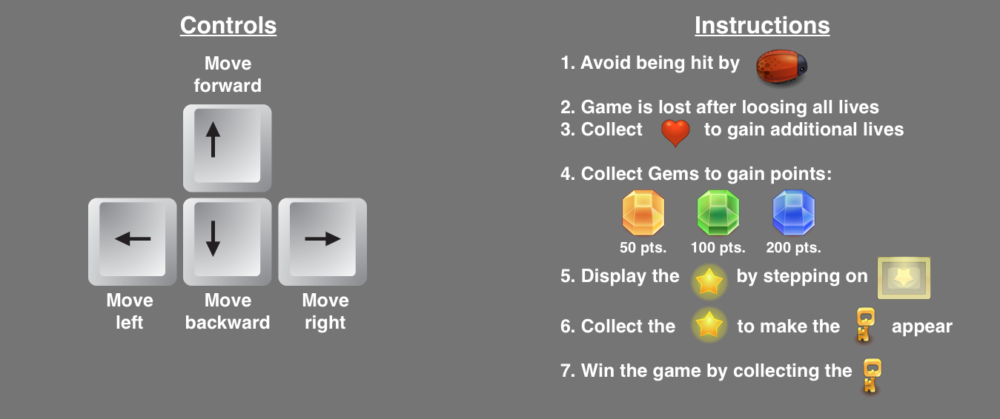

FROGGER ARCADE GAME
===============================

CONTENTS OF THIS FILE
---------------------

 * Introduction
 * Installation
 * Gameplay

INTRODUCTION
------------
Third project from the Front-End Web Developer Nanodegree in [Udacity](http://www.udacity.com):
recreated the classic arcade game Frogger with Object-Oriented JavaScript and HTML5 Canvas.

INSTALLATION
------------
Download the repository in your desktop, unzip it and open the "index.html" file in your browser to play the game. Alternatively you can click [here](#) to play a live demo

GAMEPLAY
------------

